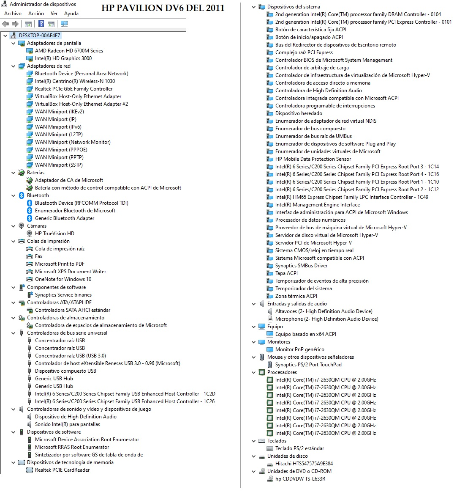

- **LAPTOP dv6-6180la + windows + 10 + drivers**

  - **Características**

    - PC portátil de entretenimiento HP Pavilion dv6-6180la
    - Serial:
      - 5CH14112HQ
    - Product:
      - A2U69LA#ABM
    - CustModel:
      - dv6-6180la
    - Warranty:
      - 1y1y0y
    - PCID:

      - 058E110000244710000620100

    - **System Information (Presionar ESC y luego F1)**
      - Notebook Model: HP Pavillion dv6 Notebook PC
      - Product Number: A2U69LA#AEM
      - Serial Number: 5CH14112HQ
      - Warranty Start Date: 10/14/2011
      - System board ID: 3388
      - Product configuration ID: 058E110000244710000620100
      - System Board CT Number: PBZAU04HT1H00N
      - BIOS Version: F.1A
      - Processor Type: Intel(R) Core(TM) i7-2630QM CPU @ 2.00GHz
      - Processor Spedd: 2000 MHZ
      - Total Memory: 12 GB
      - Primary Battery SN: 04147 09/17/2011
      - WLAN FCC ID: PD911230BNHU
      - Bluetooth FCC ID:

  - **Entrar al BIOS**
    - **LAPTOP dv6-6180la**
      - Con **F10**
        - Colocar el drive USB en el equipo
        - Prender y presionar de manera repetitiva **F10**
          - En **Boot Options** Existe una entrada **POST HotKey Delay (sec)**
            - **POST hotkey delay** es una configuración del BIOS que controla que tiempo un usuario tiene para presionar la tecla de función para entrar a la utilidad de Setup cuando el computador arranca.
              - [Que hace POST hotkey delay](https://h30434.www3.hp.com/t5/Notebook-Operating-System-and-Recovery/How-much-of-a-delay-in-seconds-should-I-set-up-Also-what-the/td-p/6271964)
        - Ir a **Boot Order** y colocar primero al USB.
        - Guardar y Salir/reboot.
      - Con **ESC** para que salga el siguente menú
        - Menu
          - F1 System Information
          - F2 System Diagnostic
          - F9 Boot Device Options
          - F10 BIOS Setup
          - F11 System Recovery
          - F12 Network BOOT
        - Seleccionar **F10** para hacer lo que indica en Con **F10**
        - Podría ser que se necesite **F9** para seleccionar el USB

- **Windows 10**

  - Descargar Imagen

    - [Tecnación Daez:👨‍💻 Informática - Descargar Windows 10 ultima versión (Imagen ISO) | 2021 | ✅](https://www.youtube.com/watch?v=GHLoYw_6ias)
      - Ir a [Descargar Windows 10](https://www.microsoft.com/es-es/software-download/windows10)
      - Seleccionar **Descargar ahora** en **Crear medios de instalación de Windows 10**
        - MediaCreationTool_22H2.exe
      - Pero eso no me sirve, en esta pantalla presionar click derecho y dar en "Inspeccionar"
      - Presionar para ver como en **dispositivo móvil**
      - Hacer click en recargar y cerrar el inspector de página
      - Ahora en sección **Actualización de Windows 10 2023 | Versión 22H2**
      - Seleccionar el idioma
      - Seleccionar 64 o 32 bits.

  - [MovilAndroide: Instala Windows 11/10 en un disco duro sin usar Pendrives ni Discos de Instalación](https://www.youtube.com/watch?v=HMhaejCWuM4)
    - [MovilAndroide: Instala Windows 11/10 en un disco duro sin usar Pendrives ni Discos de Instalación](https://movilandroide.com/instalar-windows-11-10-sin-usar-pendrives-ni-discos-de-instalacion/)
      - **Requisitos**
        - Un PC con Windows instalado
        - El disco duro donde vayamos a instalar Windows debe estar conectado a la placa base del PC mediante un cable serial ATA
        - El archivo .ISO de instalación
        - Bajar programa [WinToHDD](https://www.easyuefi.com/wintohdd/index.html)
      - **Proceso**
        - Ejecutar **WinToHDD** y seleccionar **Instalación Nueva**
        - Seleccionar el **.ISO** y elegir la versión
        - **Unidad de destino** ponemos el nuevo disco
        - Selected device needs to be formatted, plase select the partition schema
          - MBR para BIOS <----- 📌
          - GPT para UEFI
          - Conservar el esquema de partición existente
        - La unidad se formatea y se crea una pequeña partición de sistema y una de arranque y formateamos las dos.
        - Al finalizar se tendrá windows instalado pero sin configurar. (En carpeta Usuarios no aparece ni siquiera el usuario)
        - Cambiar el Disco al nuevo equipo para que al prenderlo se empiece a configurar.

- **Unidades de arranque**

  - [elmondigital: 2 USB de arranque que TODO USUARIO de PC debería crear (Antes de que sea tarde)](https://www.youtube.com/watch?v=Ued2kyWywqI)

    - Formatear flash

      - Click derecho unidad
      - Formatear
      - formato: NTFS
      - Etiqueta
      - Iniciar

    - **USB #1**:

      - Descdargar herramienta de creación de medios de windows

        - Verificar tus discos duros
        - Verificar tu sistema de archivos de Windows
        - Eliminar actualizaciones
        - Ejecutar la restauración del sistema.

        - Ir a google y escribir descargar la herramienta de creación de medios de windows 10
          - Descargar ahora la herramienta
          - Ejecutarlo
          - Aceptar acuerdo de licencia
          - Crear medios de instalación (unidad flash USB, DVD o archivo ISO) para otro PC
          - Seleccionar Idioma, arquitectura y edición.
          - Elegir el medio a usar
            - Unidad Flash USB
            - Archivo ISO
          - Seleccionar unidad flash USB

      - **USB # 2**
        - Creación del Disto de Hiren´s BootCD
          - Buscar en google "descargar Hiren´s Boot USB"
          - Seleccionar Hiren´s BootCD PE (hidensbootcd.org)
          - Ir al archivo ISO: HBDC_PE_x64.iso y dar click
          - Seleccionar USB booting.
          - Descargar Rufus
          - Rufus
            - Doble clik en Rufus descargado.
            - Presionar Alt + E para activar el modo uefi dual
              - Aparece en la parte inferior "Modo dual EFI/BIOS desactivado"
            - Seleccionar el archivo "HBDC_PE_x64.iso"
            - Sistema Destino: Bios o UEFI
            - Esquema de partición
              - W10: mbr
              - W11: gpt
            - Para sistemas viejos activar "Agregar particiones para BIOS viejos (partición extra, alineación, etc)
            - Usar MBR de Rufus con ID de BIOS y el valor predeterminado
            - Empezar
          -

- [ComputerShopping: Como instalar Windows 10 en 2023 desde USB - TUTORIAL!](https://www.youtube.com/watch?v=WxDA6q0ND1s)

- [Javier Marin: Windows 10 y 11 desde cero: Crear dos particiones antes de instalar.](https://www.youtube.com/watch?v=WN1bNE9e9zw)

  - **Crear Partición**

    - En la pantalla <code>¿Dónde quieres instalar Windows?</code> seleccionar **Nuevo**

      - Disco Duro Particioneas

        - 50MB - Reservado para el Sistema
        - 200GB - Disco C - NTFS
        - 200GB - Disco D - NTFS - Datos
        - 200GB - Disco E - NTFS - DatosDos
        - 93.39GB - No Asignado

        - 204,800 MB -> 200 GB [convertidor](https://tradukka.com/unit/storage/gigabyte/megabyte?hl=es)

- **DRIVERS**

  - SDI (https://www.youtube.com/watch?v=vc63owOUUoY)
    - Bajar utorrent: https://getintopc.com/softwares/utorrent-pro-2019-free-download/ o en su defecto qBittorrent
    - Bajar SDI Drivers
      - how to download and install SDI drivers (step by step)
        - https://www.youtube.com/watch?v=vc63owOUUoY
      - SDI
        - https://sdi-tool.org/download/
        - seleccionar Torrent y download SDI Full
        - Alternativa para no descargar todo lo de SDI
          - Snappy Driver El mejor buscador de Drivers (Controladores) para Windows
            - https://www.youtube.com/watch?v=cIlqUAsEleE
      - qBittorrent
        - https://www.qbittorrent.org/download
        - Download qBittorrent v4.5.4
    - Una vez bajado el torrent de SDI Drivers abrirlo con qBittorrent y mandar a bajarlo
    - Entrar a la descarga realizada y ejecutar "SDI_x64_R2305.exe"
      - Idioma: Español
      - Tema: Grass
      - Modo Experto: Visto
      - Incluído en DireverPacks
        - No Instalado
        - Más nuevo
        - Más apropiado
      - No incluido en DriverPacks
        - No instalado
      - Presionar botón "Seleccionar Todo"
      - Presionar botón "Instalar"
  - **Drivers - HP Pavilion dv6-6180la**

    

- Para el tema de drivers 20250121

  - [Crear una lista con todos los controladores del sistema](https://www.softzone.es/windows/como-se-hace/ver-controlado)

    - cmd
    - <code>driverquery</code>
    - PowerShell
      - <code>Get-WmiObject Win32_PnpSignedDriver| select DeviceName, Manufacturer, DriverVersion Get-WmiObject Win32_PnPSignedDriver| select DeviceName, Manufacturer, DriverVersion</code>
    - Otros Programas
      - InstalledDriverList
      - IObit Driver Booster
    - **Crear copia y restaurar con Dism** 
      - [Utilizar CMD para copiar y restaurar drivers de Windows]https://www.softzone.es/windows/como-se-hace/truco-cmd-ver-guardar-drivers/)
        - Copia
          - <code>dism /online /export-driver /destination:C:/Copia-seguridad-drivers_conDism</code>
            - [export-driver](https://learn.microsoft.com/es-es/windows-hardware/manufacture/desktop/dism-driver-servicing-command-line-options-s14?view=windows-11#export-driver)
        - Restaurar
          - <code>dism /online /Add-Driver /Driver: C:/Copia-seguridad-drivers_conDism /Recurse</code>
            - [add-driver](https://learn.microsoft.com/es-es/windows-hardware/manufacture/desktop/dism-driver-servicing-command-line-options-s14?view=windows-11#add-driver)
          - <code>dism /online /Add-Driver /Driver: D:\Borrar_20250121\b00_Documentacion_AyudasSubidasAGithub\z_Respaldos\Copia-seguridad-drivers_conDism /Recurse</code>
          - <code>dism /online /Add-Driver /Driver:D:\Borrar_20250121\b00_Documentacion_AyudasSubidasAGithub\z_Respaldos\Copia-seguridad-drivers_conDism /Recurse</code>
          
          - La herramienta DISM (Deployment Image Servicing and Management) con el comando **DISM /Cleanup-Image** analiza y repara la imagen de Windows
            - dism /Online /Cleanup-Image /AnalyzeComponentStore (https://www.youtube.com/watch?v=c95a5HweNr0)

  - [Windows 10 tendrá carpeta OEMDRIVER para controladores de terceros](https://www.muycomputer.com/2021/03/30/controladores-de-windows/)
    - hacker Albacore ()
      - OEMDRIVERS
      - %SystemRoot%\System32\DriverStore
      - En las versiones actuales de Windows 10, todos los controladores, ya sean controladores de Microsoft o de terceros, se almacenan juntos en DriverStore.
  - [TutosVideos: Como Guardar Drivers o Controladores Antes de Formatear tu PC: Trucos y Pasos Cruciales](https://www.youtube.com/watch?v=DombCEIloag)
    - [TutosVideos: Como Guardar Drivers o Controladores Antes de Formatear tu PC: Trucos y Pasos Cruciales](https://tutosvideos.com/4089/)
      - windows/System32/DriverStore Los controladores estarán en carpeta FileRepository
      - [Driver Genius: DG_Setup](https://www.mediafire.com/file/8vcsnxh1ob77sq1/DG_Setup.exe/file)
        - [Driver Genius: DG_Setup](https://drivergenius.es/))

  - [¿En qué CARPETA se GUARDAN los DRIVERS en WINDOWS 10?](https://www.dailymotion.com/video/x8xmndw)
  - [✅ Cómo REPARAR automáticamente PROBLEMAS de BUCLE en Windows 11🔴 Reparación de INICIO de Windows](https://www.youtube.com/watch?v=lXdGJBv6OJQ)
    - diskpart
      - list volume 
        - Ver en que volumen está instalado
      - exit 
    - chkdsk c: 
      - Escanea en busca de errores 
        - chkdsk c: /r /f
        - NUNCA DETENER A LA MITAD X Q PUEDES DAÑAR SISTEMA DE ARCHIVOS Y SE VUELVEN IRRECUPERABLES 
    - Examinar sistema operativo en busca archivos daños y reparlos o sustituirlos
      - sfc /scannow  
    - Actualizar directivas. si no pertenece a un domineo no funcionará.
      - gpupdate
    - Reparar el boot del sistema operativo.
      - bootrec /fixmbr
      - bootrec /fixboot
    - exit 
    - apagar equipo 
    - Si no funcionaria volver a inicio avanzado windows
      - Solucionar problemas 
        - Restablecer este equipo 
          - formateará con dos opciones mantener o formatear todo.
