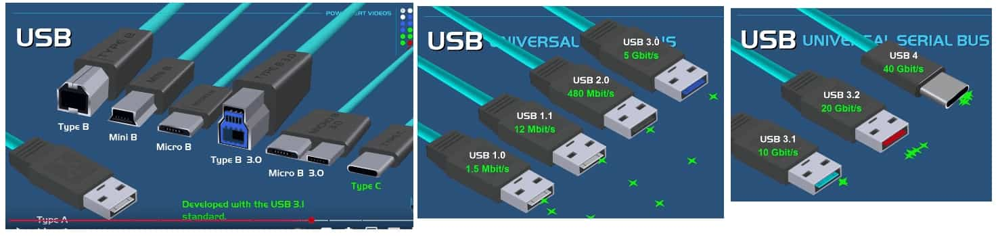
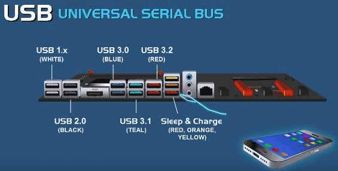

- Tipos de USB

  - [PowerCert Animated Videos: Puertos, cables y conectores USB](https://www.youtube.com/watch?v=pIZREjck9jg)

    - USB: Universal Serial Bus
    - Objetivo
      - Hacer un conector estandar
      - Hacer dispositivos conectados fáciles de configurar
      - Proveer rangos de transferencia altos.
    - Características
      - Es **Hot swappable** es decir puede ser conectado o desconectado en caliente.
      - Es **Self configures** eliminando la necesidad de alguna configuración.
      - Puede **proveer de energía a algunos dispositivos**
    - Versiones
      - **USB 1.0**
        - Liberada (released) en 1996
        - Velocidad de 1.5 Mbit/s
        - Puerto generalmente de color **blanco**
      - **USB 1.1**
        - Liberada (released) en 1998
        - Velocidad de 12 Mbit/s
        - Puerto generalmente de color **blanco**
      - **USB 2.0** (High speed USB)
        - Liberada (released) en 2000
        - Velocidad de 480 Mbit/s
        - Puerto generalmente de color **negro**
      - **USB 3.0** (Super speed USB)
        - Liberada (released) en 2008
        - Velocidad de 5 Gbit/s
        - Puerto generalmente de color **azul**
      - **USB 3.1** (Super speed plus)
        - Liberada (released) en 2013
        - Velocidad de 10 Gbit/s
        - Puerto generalmente de color **verde azulado (teal)**
      - **USB 3.2**
        - Liberada (released) en ????
        - Velocidad de 20 Gbit/s
        - Puerto generalmente de color **rojo**
      - **USB 4.0**
        - Liberada (released) en 2019
        - Velocidad de 40 Gbit/s
    - Versiones de cables, conectores y puertos
      - **Tipo A**
        - Es el conector del Host
        - Es el tipo más viejo y aún usado ampliamente.
      - **Tipo B**
        - Cuadrado con esquinas biceladas
        - Es un conector antiguo pero aún usado.
        - Es usado mayormente en impresoras, pero también en discos duros externos, micrófonos.
          - **Tipos**
            - **Mini B**
              - Más pequeño que el conector tipo B
              - Usado para dispositivos pequeños como modelos antiguos de celulares y en cámaras digitales.
            - **Micro B**
              - Sale en 2007 y desarrollado para reemplazar al mini B.
              - Tiene aproximadamente el mismo ancho que el conector mini B, pero es aproximadamente la mitad de alto.
              - Se usa para celulares modernos, cámaras modernas, MP3 players.
            - **USB tipo B 3.0**
              - Tiene 9 pines comparados con los 4 de la versión anterior.
              - Permite altas velocidades de transferencia y proveer energía a los periféricos.
              - Este conector es más largo y tiene una forma diferente de las versiones 1.0 y 2.0
            - **USB tipo B micro 3.0**
              - Es más delgado básicamente como la versión 2.0 pero es más ancho
              - Tiene 5 pines adicionales que están a un lado del conector, lo que hace que doble el ancho del 2.0 micro B.
              - Se usa para manejar data y proveer energía a los dispositivos como discos duros externos modernos.
      - **Tipo C**
        - Sale en 2014
        - Fue desarrollado con el estándar del USB 3.1
        - Es un conector delgado con esquinas redondeadas.
        - Tiene 24 pines y puede ser conectado fácilmente en los puertos ya que no tiene una orientación de arriba / abajo.
        - Se lo encuentra en celares inteligentes modernos, discos duros modernos, desktops y laptops modernos.
        - Es incluso utilizado para cargar una larga variedad de dispositivos incluso estando el anfitrión en invernación.
    - Gráficos
      
      

- [TICnoticos: TODOS los tipos de USB explicados fácil](https://www.youtube.com/watch?v=8sxOqk-x-l4)
  - USB tipo A
    - Estandar utilizado durante las últimas décadas
    - Sirve para la mayoría de periféricos como: mouse, teclados, aros de luz, etc.
    - 2.0 es de color blanco
    - 3.0 es de color azul
  - USB tipo B
    - Utilizado sobre todo en cables de impresora, discos externos, organetas lectoras, micrófonos usb,
  - USB mini
    - Nace en la época de los 2000 - 2010
    - La mayoría de teléfonos venían con este puerto, también altavoces, controles de videoconsolas
  - USB micro
    - smartphones, controles de videoconsolas, cámaras web cams
  - USB micro-B
    - Tiene más pines
    - Usado en discos duros externos o en USB 3.0
  - USB tipo C
    - Se convirtió en el nuevo estándar mundial de conexión
    - Sirve para cargar y para transferir información a altas velocidades.
