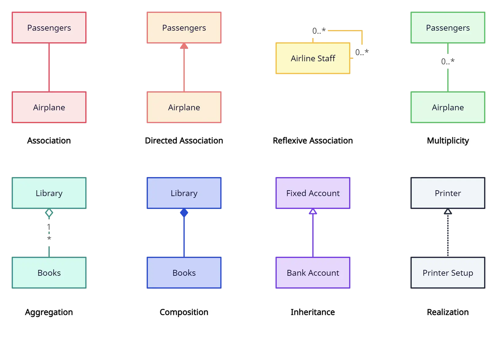
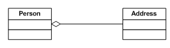
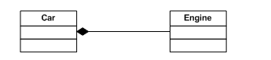
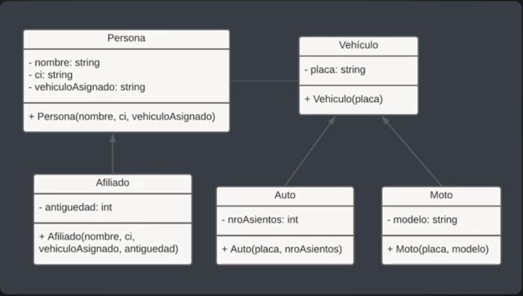
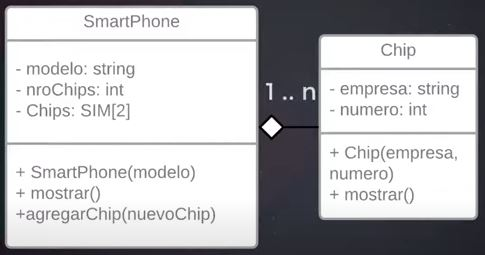
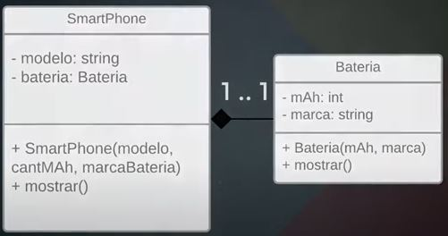
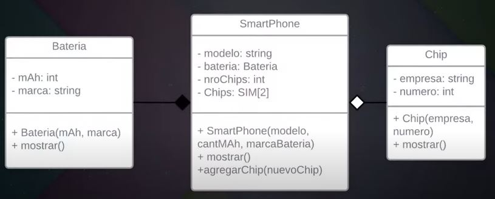

- UML

  - [PROCESO DE DISEÑO DEL SISTEMA](https://www.u-cursos.cl/ingenieria/2011/1/CC61J/1/material_docente/bajar?id_material=372021)

    - Documentación en español de todo el proceso.
    - MUY BUENO

  - [UML Class Diagram Relationships Explained with Examples](https://creately.com/guides/class-diagram-relationships/)

    - Tiena una explicación y diagramación de cada tipo.

    

    - **Association**
      - is a broad term that encompasses just about any logical connection or relationship between classes. For example, passengers and airline may be linked as above.
    - **Directed Association**
      - refers to a directional relationship represented by a line with an arrowhead. The arrowhead depicts a container-contained directional flow.
    - **Reflexive Association**
      - This occurs when a class may have multiple functions or responsibilities. For example, a staff member working in an airport may be a pilot, aviation engineer, ticket dispatcher, guard, or maintenance crew member. If the maintenance crew member is managed by the aviation engineer there could be a managed by relationship in two instances of the same class.
    - **Multiplicity**
      - is the active logical association when the cardinality of a class in relation to another is being depicted. For example, one fleet may include multiple airplanes, while one commercial airplane may contain zero to many passengers. The notation 0..\* in the diagram means “zero to many”.
    - **Aggregation**
      - refers to the formation of a particular class as a result of one class being aggregated or built as a collection. For example, the class “library” is made up of one or more books, among other materials. In aggregation, the contained classes are not strongly dependent on the lifecycle of the container. In the same example, books will remain so even when the library is dissolved. To show aggregation in a diagram, draw a line from the parent class to the child class with a diamond shape near the parent class.
      - To show aggregation in a diagram, draw a line from the parent class to the child class with a diamond shape near the parent class.
    - **Composition**
      - The composition relationship is very similar to the aggregation relationship. with the only difference being its key purpose of emphasizing the dependence of the contained class to the life cycle of the container class. That is, the contained class will be obliterated when the container class is destroyed. For example, a shoulder bag’s side pocket will also cease to exist once the shoulder bag is destroyed.
      - To show a composition relationship in a UML diagram, use a directional line connecting the two classes, with a filled diamond shape adjacent to the container class and the directional arrow to the contained class.
    - **Inheritance/Generalization**
      - refers to a type of relationship wherein one associated class is a child of another by virtue of assuming the same functionalities of the parent class. In other words, the child class is a specific type of the parent class. To show inheritance in a UML diagram, a solid line from the child class to the parent class is drawn using an unfilled arrowhead.
    - **Realization**
      - denotes the implementation of the functionality defined in one class by another class. To show the relationship in UML, a broken line with an unfilled solid arrowhead is drawn from the class that defines the functionality of the class that implements the function. In the example, the printing preferences that are set using the printer setup interface are being implemented by the printer.

  - [Aggregación vs Composición Explicado](https://www.gleek.io/blog/aggregation-vs-composition)

    - Excelente artículo para entenderlo.

  - **Implementación de Asociación, Agregación y Composición en C#**

    - [Mirar el post de "Nguyễn Văn Phong" "answered Jun 17, 2021 at 1:29"](https://stackoverflow.com/questions/12604031/c-sharp-code-for-association-aggregation-composition#answer-68011774)

      - Mirar el post de "Nguyễn Văn Phong" "answered Jun 17, 2021 at 1:29"

      If inheritance gives us <code>'is-a'</code> and composition gives us <code>'part-of'</code>, we could argue that aggregation gives us a <code>'has-a'</code> relationship.
      ==> In short, Association, Aggregation, and Composition are terms that represent relationships among objects.

      - **Asociación**

        - Association means that an object "uses" another object. As you said: "Association is a weaker form of Aggregation where the class doesn't keep a reference to the object it receives."

        ```c#
          public class Association
          {
            //SomeUtilityClass \_obj /_NO local reference maintained _/
            public void doSomething(SomeUtilityClass obj)
            {
              obj.DoSomething();
            }
          }
        ```

      - **Agregación**

        - Aggregation is a special type of Association.
        - Aggregation is "has-a" relationship among objects (white diamond)
        - For example, Person 'has-a' Address.
        - As you can see, the Person does not manage the lifetime of Address. If the Person is destroyed, the Address still exists.

          - Person <>---- Address

        

        ```c#
          public class Address
          {
            ....
          }

          public class Person
          {
           private Address address;
           public Person(Address address)
           {
            this.address = address;
           }
           ....
          }
        ```

      - **Composición**

        - Composition is a special type of Aggregation, It is a strong type Aggregation.
        - Composition gives us a 'part-of' relationship(dark diamond). Ex: Engine is part-of a car

        

        ```c#
          public class Engine
          {
            ....
          }

          public class Car
          {
           Engine e = new Engine();
           .......
          }
        ```

      - Please, prefer the links below to get future information:

        - https://www.c-sharpcorner.com/UploadFile/ff2f08/association-aggregation-and-composition/
        - https://www.c-sharpcorner.com/article/difference-between-composition-and-aggregation/

  - [Association, Aggregation, and Composition in C#](https://medium.com/@ibrahimyengue/association-aggregation-and-composition-in-c-8cbeaa81201d)

    - Sharp_MAUI

  - [Programmer Not Found - 404 Error: Programación orientada a objetos (lista de reproducción)](https://www.youtube.com/playlist?list=PLlsIrByBKGV12-WCzehY1cqYSBDShqahU)

    - [Programmer Not Found - 404 Error: Herencia en Programacion Orientada a Objetos](https://www.youtube.com/watch?v=tyZdXb4WMnQ&list=PLlsIrByBKGV12-WCzehY1cqYSBDShqahU)

      - **Herencia**

        - Hay herencia simple y herencia múltiple.
        - Se tiene dos clases con atributos / métodos comunes, creamos una clase con los atributos comunes y heredamos a los detalles de las otras.
        - Se representa con un triángulo en la clase que hereda que llega a las clases hijas o subclases.
        - se lee como "es un"
          - Un Auto "es un" Vehículo.
          - Una Moto "es un" Vehículo.
        - Ejemplo:

          - tenemos un pequeño sindicato de trufis y motos ahí trabajan afiliados o personas comunes en donde cada uno tiene asignado un determinado vehículo ya sea un auto o una moto.
          - Necesitamos registrar a dos afiliados y a una persona común que tienen asignados dos autos y una moto respectivamente.
          - También se necesita comparar la antigüedad entre los miembros del sindicato y verificar si un conductor tiene asignado un determinado auto o moto.

          

          - Consideraciones para la correcta implementación de herencia:

            - Los atributos que queremos compartir con los hijos deben ser de tipo "protected" sin Setters y Getters.
            - Las subclases reciben los mismos atributos que su padre además de los propios.

          - Creación de objetos.

            ```c#
              public class Persona
              {
                //Atributos
                protected String nombre;
                protected String ci;
                protected String vehiculoAsignado;
                //Constructor
                public Persona(String nombre, String ci, String vehiculoAsignado)
                {
                  this.nombre = nombre;
              	  this.ci = ci;
              	  this.vehiculoAsignado = vehiculoAsignado
                }
                //Metodos
                public void mostrar()
                {
                  system.out.println("Nombre: " + nombre);
              	  system.out.println("Ci: " + ci);
              	  system.out.println("Vehículo asignado: " + vehiculoAsignado);
                }
              }

              public class Afiliado extends Persona
              {
                //Atributos
                private int antiguedad;
                //Constructor
                public Afiliado(String nombre, String ci, String vehiculoAsignado, int antiguedad)
                {
                  super(nombre, ci, vehiculoAsignado);
              	  this.antiguedad = antiguedad;
                }
                //Metodos
                public void mostrar()
                {
                  super.mostrar();
              	  system.out.println("Antiguedad: " + antiguedad);
                }
              }
            ```

      - **Agregación y Composición**

        - [404 Not Found: Agregación y Composición en POO](https://www.youtube.com/watch?v=U9-iM-gA7-E&t=286s)

          - **Agregación**

            - Ejemplo: Celular y tarjeta sims. Cuando celulcar se crea no tiene tarjeta sims, se lo agrega uno, dos, el sims no es parte del celular solamente está dentro de él, es decir puede funcionar una independientemente del otro.
            - Roles.

              - Contenedor
              - Elemento: Sigue existiendo aún cuando "clase Contenedor" sea destruida.

            - Representación

              - Es una línea con un "ROMBO VACÍO" apuntando A CLASE CONTENEDORA
              - Lectura:
                - Un SmartPhone "Tiene" un Chip
                - Un Chip "está en" un SmartPhone
              - Cardinalidad

                - "Un" SmartPhone puede tener "varios" Chips
                - "Un" Chips solo puede estar en "un" SmartPhone

            

        - **Composición**

          - Ejemplo: Celular y batería. Cuando celular no puede funcionar sin una batería, este es un ejemplo de composición ya que la "clase batería" depende del celular. tarjeta sims, se lo agrega uno, dos, el sims no es parte del celular solamente está dentro de él, es decir puede funcionar una independientemente del otro.

          - Roles.
            - Todo
            - Parte: Sigue existiendo aún cuando "clase Contenedor" sea destruida.
          - Regla

            - Si el objeto "Todo" es destruído también serán destruídas sus "partes".

          - Representación

            - Es una línea con un "ROMBO LLENO" apuntando A CLASE TODO
            - Lectura:
              - Un SmartPhone "se compone de" una Bateria
              - Una Bateria "compone a" un SmartPhone
            - Cardinalidad

              - "Un" SmartPhone se compone de "una" Bateria
              - "Una" Bateria es parte (compone a) "un" SmartPhone

          

          - [Christopher Okhravi: Strategy Pattern - Design Patterns (ep 1)](https://www.youtube.com/watch?v=v9ejT8FO-7I&list=PLrhzvIcii6GNjpARdnO4ueTUAVR9eMBpc)
            - ----|> is-a "herencia"
            - -----> has-a "composición"
              - DUCK ---> WILD DUCK
                - DUCK "has a" WILD DUCK

        - **Ejemplo de Agregación y Composición**

          

          Bateria compone a un smartPhone que tiene un chip

          1.- Crear las clases que son independientes (Chip y Bateria)
          2.- Crear la clase que referencia a las otras
          3.- Consideraciones para la correcta implementación de composición: - En el Constructor - Si se elimina la clase todo debe eliminarse la clase parte; entonces es recomendable instanciar la clase parte dentro del constructor por ese motivo en el constructor de la clase todo se reciben los parámetros de la clase parte.
          4.- Consideraciones para la correcta implementación de agregación: - En el Constructor - El atributo que relaciona con agregación, es decir el "elemento" con el "contenedor" se inicializa con valor 0, se inicializa el vector del elemento pero sin ningún dato. - En los métodos - Usualmente tendremos un método para agregar una cantidad de partes.
          5.- Creación de objetos.

          ```c#
            public class Bateria
            {
              //Atributos
              private int mAh;
              private String marca;
              //Constructor
              public Bateria(int mAh, String marca)
              {
                this.mAh = mAh;
                this.marca = marca;
              }
              //Metodos
              public void mostrar()
              {
                system.out.println("Cantidad mAh: " + mAh);
                system.out.println("Marca: " + marca);
              }
            }
            public class Chip
            {
              //Atributos
              private String empresa;
              private int numero;
              //Constructor
              public Chip(String empresa, int numero)
              {
                this.empresa = empresa;
                this.numero = numero;
              }
              //Metodos
              public void mostrar()
              {
                system.out.println("\tEmpresa: " + empresa);
                system.out.println("\tNro cel: " + numero);
              }
            }
            public class SmartPhone
            {
              //Atributos
              private String modelo;
              private Bateria bateria; // relación composición
              private int nroChips;
              private Chips[] chips; //relación agregación
              //Constructor
              public SmartPhone(String modelo, int cantMAh, string marcaBateria)
              {
                this.modelo = modelo;
                this.bateria = new Bateria(cantMAh, marcaBateria);
                this.nroChips = 0;
                this.chips = new Chip[2];
              }
              //Metodos
              public void mostrar()
              {
                system.out.println("Modelo: " + modelo);
                bateria.mostrar();
                system.out.println("Nro Chips: " + nroChips);
                for (int i=0; i< nroChips; i++)
                {
                  chips[i].mostrar();
                }
              }
              public void agregarChip(Chip nuevoChip)
              {
                if (nroChips < 2)
                {
                  chips[nroChips] = nuevoChip;
                  nroChips++;
                }
                bateria.mostrar();
                system.out.println("Nro Chips: " + nroChips);
                for (int i=0; i< nroChips; i++)
                {
                  chips[i].mostrar();
                }
              }
            }
            public class Main
            {
              public static void main(String[] args)
              {
                SmartPhone cel = new SmartPhone("A10PRO", 3400, "Samsung");
                Chip entel = new Chip("Entel", 79033881);
                Chip tigo = new Chip("Tigo", 69920081);
                cel.agregarChip(entel);
                cel.agregarChip(tigo);
                cel.mostrar();
              }
            }
          ```

- Patrones de diseño

  - Prototype

    - MitoCode: Curso de Patrones de diseño - 5 Prototype
      - https://www.youtube.com/watch?v=M3VT1v54cq4&list=PLvimn1Ins-41Uiugt1WbpyFo1XT1WOquL&index=5
    - Nicolas Battaglia: Patrón de diseño Prototype en C#

      - https://www.youtube.com/watch?v=mWLeTd-Gi34

        - Habla sobre copiado simple y profundo.
