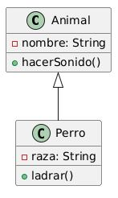
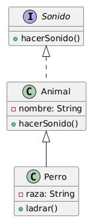
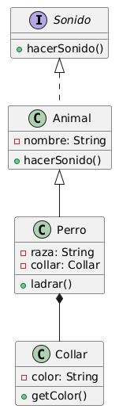
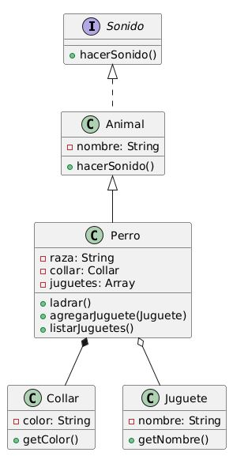
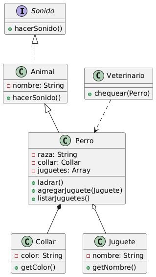
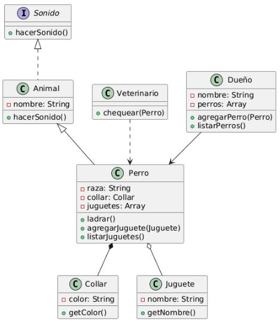
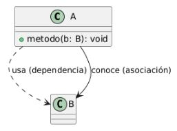
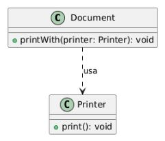

# **Tutorial de UML y JavaScript: Relaciones entre Clases**

## **Índice**
1. [Relación de Extensión (Herencia)](#relación-de-extensión-herencia)
2. [Agregar una Interfaz](#agregar-una-interfaz)
3. [Relación de Composición](#relación-de-composición)
4. [Relación de Agregación](#relación-de-agregación)
5. [Relación de Dependencia Débil](#relación-de-dependencia-débil)
6. [Relación de Asociación](#relación-de-asociación)
7. [Preguntas Frecuentes](#preguntas-frecuentes)
8. [A usa B vs A conoce B](#A-usa-B-vs-A-conoce-B)


---

## **1. Relación de Extensión (Herencia)** <a name="relación-de-extensión-herencia"></a>

### **Diagrama de Clases en UML**

<table>
  <tr>
    <th>Diagrama Renderizado</th>
    <th>Código PlantUML sin Renderizar</th>
    <th>Gráfico GIT</th>
  </tr>
  <tr>
  <td>
      
  ```plantuml
      @startuml
      class Animal {
        - nombre: String
        + hacerSonido()
      }

      class Perro {
        - raza: String
        + ladrar()
      }

      Animal <|-- Perro
      @enduml
  ```

  </td>
  <td>
      <!-- Columna 2: Código PlantUML sin renderizar -->
  <pre>

      @startuml
      class Animal {
        - nombre: String
        + hacerSonido()
      }

      class Perro {
        - raza: String
        + ladrar()
      }

      Animal <|-- Perro
      @enduml

  </pre>
  </td>
  <td>
      <!-- Columna 3: Gráfico Git-->
    
  </td>
  </tr>
</table>


### **Código en JavaScript (Clases)**
```js
// Clase base (superclase)
class Animal {
  constructor(nombre) {
    this.nombre = nombre; // Atributo privado (convención con _)
  }

  // Método público
  hacerSonido() {
    console.log(`${this.nombre} hace un sonido.`);
  }
}

// Clase derivada (subclase)
class Perro extends Animal {
  constructor(nombre, raza) {
    super(nombre); // Llama al constructor de la clase base
    this.raza = raza; // Atributo adicional
  }

  // Método adicional
  ladrar() {
    console.log(`${this.nombre} (${this.raza}) está ladrando: ¡Guau guau!`);
  }
}

// Ejemplo de uso
const miPerro = new Perro("Rex", "Pastor Alemán");
miPerro.hacerSonido(); // Heredado de Animal
miPerro.ladrar();      // Específico de Perro
```


### **Código en JavaScript (Funciones Constructoras)**
```js
// Función constructora para la clase base (Animal)
function Animal(nombre) {
  this.nombre = nombre; // Atributo privado (convención con _)
}

// Método público para Animal
Animal.prototype.hacerSonido = function () {
  console.log(`${this.nombre} hace un sonido.`);
};

// Función constructora para la clase derivada (Perro)
function Perro(nombre, raza) {
  Animal.call(this, nombre); // Llama al constructor de la clase base
  this.raza = raza; // Atributo adicional
}

// Establecer la herencia (Perro hereda de Animal)
Perro.prototype = Object.create(Animal.prototype);
Perro.prototype.constructor = Perro;

// Método adicional para Perro
Perro.prototype.ladrar = function () {
  console.log(`${this.nombre} (${this.raza}) está ladrando: ¡Guau guau!`);
};

// Ejemplo de uso
const miPerro = new Perro("Rex", "Pastor Alemán");
miPerro.hacerSonido(); // Heredado de Animal
miPerro.ladrar();      // Específico de Perro
```

## **2. Agregar una Interfaz** <a name="agregar-una-interfaz"></a>

### **Diagrama de Clases en UML**

<table>
  <tr>
    <th>Diagrama Renderizado</th>
    <th>Código PlantUML sin Renderizar</th>
    <th>Gráfico GIT</th>
  </tr>
  <tr>
  <td>
      
  ```plantuml
      @startuml
      interface Sonido {
        + hacerSonido()
      }

      class Animal {
        - nombre: String
        + hacerSonido()
      }

      class Perro {
        - raza: String
        + ladrar()
      }

      Sonido <|.. Animal
      Animal <|-- Perro
      @enduml
  ```

  </td>
  <td>
      <!-- Columna 2: Código PlantUML sin renderizar -->
  <pre>

      @startuml
      interface Sonido {
        + hacerSonido()
      }

      class Animal {
        - nombre: String
        + hacerSonido()
      }

      class Perro {
        - raza: String
        + ladrar()
      }

      Sonido <|.. Animal
      Animal <|-- Perro
      @enduml

  </pre>
  </td>
  <td>
      <!-- Columna 3: Gráfico Git-->
    
  </td>
  </tr>
</table>

### **Código en JavaScript (Clases)**
```js
// Definición de la interfaz (en JavaScript no existe "interface", se simula con clases)
class Sonido {
  hacerSonido() {
    throw new Error("Método hacerSonido() debe ser implementado");
  }
}

// Clase base (Animal) que implementa la interfaz Sonido
class Animal extends Sonido {
  constructor(nombre) {
    super();
    this.nombre = nombre;
  }

  // Implementación del método de la interfaz
  hacerSonido() {
    console.log(`${this.nombre} hace un sonido.`);
  }
}

// Clase derivada (Perro)
class Perro extends Animal {
  constructor(nombre, raza) {
    super(nombre);
    this.raza = raza;
  }

  // Método adicional
  ladrar() {
    console.log(`${this.nombre} (${this.raza}) está ladrando: ¡Guau guau!`);
  }
}

// Ejemplo de uso
const miPerro = new Perro("Rex", "Pastor Alemán");
miPerro.hacerSonido(); // Heredado de Animal
miPerro.ladrar();      // Específico de Perro
```


### **Código en JavaScript (Funciones Constructoras)**
```js
// Simulación de la interfaz Sonido (en JavaScript no existe "interface")
function Sonido() {
  if (this.constructor === Sonido) {
    throw new Error("No se puede instanciar una interfaz");
  }
  if (typeof this.hacerSonido !== "function") {
    throw new Error("Método hacerSonido() debe ser implementado");
  }
}

// Función constructora para la clase base (Animal)
function Animal(nombre) {
  Sonido.call(this); // Verifica que se implemente la interfaz
  this.nombre = nombre;
}

// Implementación del método de la interfaz
Animal.prototype.hacerSonido = function () {
  console.log(`${this.nombre} hace un sonido.`);
};

// Función constructora para la clase derivada (Perro)
function Perro(nombre, raza) {
  Animal.call(this, nombre);
  this.raza = raza;
}

// Establecer la herencia (Perro hereda de Animal)
Perro.prototype = Object.create(Animal.prototype);
Perro.prototype.constructor = Perro;

// Método adicional para Perro
Perro.prototype.ladrar = function () {
  console.log(`${this.nombre} (${this.raza}) está ladrando: ¡Guau guau!`);
};

// Ejemplo de uso
const miPerro = new Perro("Rex", "Pastor Alemán");
miPerro.hacerSonido(); // Heredado de Animal
miPerro.ladrar();      // Específico de Perro
```

## **3. Relación de Composición** <a name="relación-de-composición"></a>

### **Diagrama de Clases en UML**

<table>
  <tr>
    <th>Diagrama Renderizado</th>
    <th>Código PlantUML sin Renderizar</th>
    <th>Gráfico GIT</th>
  </tr>
  <tr>
  <td>
      
  ```plantuml
      @startuml
      interface Sonido {
        + hacerSonido()
      }
      
      class Animal {
        - nombre: String
        + hacerSonido()
      }
      
      class Perro {
        - raza: String
        - collar: Collar
        + ladrar()
      }
      
      class Collar {
        - color: String
        + getColor()
      }
      
      Sonido <|.. Animal
      Animal <|-- Perro
      Perro *-- Collar
      @enduml
  ```

  </td>
  <td>
      <!-- Columna 2: Código PlantUML sin renderizar -->
  <pre>

      @startuml
      interface Sonido {
        + hacerSonido()
      }
      
      class Animal {
        - nombre: String
        + hacerSonido()
      }
      
      class Perro {
        - raza: String
        - collar: Collar
        + ladrar()
      }
      
      class Collar {
        - color: String
        + getColor()
      }
      
      Sonido <|.. Animal
      Animal <|-- Perro
      Perro *-- Collar
      @enduml

  </pre>
  </td>
  <td>
      <!-- Columna 3: Gráfico Git-->
    
  </td>
  </tr>
</table>

### **Código en JavaScript (Clases)**
```js
// Definición de la interfaz (en JavaScript no existe "interface", se simula con clases)
class Sonido {
  hacerSonido() {
    throw new Error("Método hacerSonido() debe ser implementado");
  }
}

// Clase base (Animal) que implementa la interfaz Sonido
class Animal extends Sonido {
  constructor(nombre) {
    super();
    this.nombre = nombre;
  }

  // Implementación del método de la interfaz
  hacerSonido() {
    console.log(`${this.nombre} hace un sonido.`);
  }
}

// Clase Collar (parte de Perro)
class Collar {
  constructor(color) {
    this.color = color;
  }

  getColor() {
    return this.color;
  }
}

// Clase derivada (Perro)
class Perro extends Animal {
  constructor(nombre, raza, colorCollar) {
    super(nombre);
    this.raza = raza;
    this.collar = new Collar(colorCollar); // Composición: Perro tiene un Collar
  }

  // Método adicional
  ladrar() {
    console.log(`${this.nombre} (${this.raza}) está ladrando: ¡Guau guau!`);
  }

  // Método para obtener el color del collar
  getColorCollar() {
    return this.collar.getColor();
  }
}

// Ejemplo de uso
const miPerro = new Perro("Rex", "Pastor Alemán", "Rojo");
miPerro.hacerSonido(); // Heredado de Animal
miPerro.ladrar();      // Específico de Perro
console.log(`El color del collar es: ${miPerro.getColorCollar()}`); // Usando el Collar
```


### **Código en JavaScript (Funciones Constructoras)**
```js
// Simulación de la interfaz Sonido (en JavaScript no existe "interface")
function Sonido() {
  if (this.constructor === Sonido) {
    throw new Error("No se puede instanciar una interfaz");
  }
  if (typeof this.hacerSonido !== "function") {
    throw new Error("Método hacerSonido() debe ser implementado");
  }
}

// Función constructora para la clase base (Animal)
function Animal(nombre) {
  Sonido.call(this); // Verifica que se implemente la interfaz
  this.nombre = nombre;
}

// Implementación del método de la interfaz
Animal.prototype.hacerSonido = function () {
  console.log(`${this.nombre} hace un sonido.`);
};

// Función constructora para Collar (parte de Perro)
function Collar(color) {
  this.color = color;
}

Collar.prototype.getColor = function () {
  return this.color;
};

// Función constructora para la clase derivada (Perro)
function Perro(nombre, raza, colorCollar) {
  Animal.call(this, nombre);
  this.raza = raza;
  this.collar = new Collar(colorCollar); // Composición: Perro tiene un Collar
}

// Establecer la herencia (Perro hereda de Animal)
Perro.prototype = Object.create(Animal.prototype);
Perro.prototype.constructor = Perro;

// Método adicional para Perro
Perro.prototype.ladrar = function () {
  console.log(`${this.nombre} (${this.raza}) está ladrando: ¡Guau guau!`);
};

// Método para obtener el color del collar
Perro.prototype.getColorCollar = function () {
  return this.collar.getColor();
};

// Ejemplo de uso
const miPerro = new Perro("Rex", "Pastor Alemán", "Azul");
miPerro.hacerSonido(); // Heredado de Animal
miPerro.ladrar();      // Específico de Perro
console.log(`El color del collar es: ${miPerro.getColorCollar()}`); // Usando el Collar
```

## **4. Relación de Agregación** <a name="relación-de-agregación"></a>

### **Diagrama de Clases en UML**

<table>
  <tr>
    <th>Diagrama Renderizado</th>
    <th>Código PlantUML sin Renderizar</th>
    <th>Gráfico GIT</th>
  </tr>
  <tr>
  <td>
      
  ```plantuml
      @startuml
      interface Sonido {
        + hacerSonido()
      }

      class Animal {
        - nombre: String
        + hacerSonido()
      }

      class Perro {
        - raza: String
        - collar: Collar
        - juguetes: Array
        + ladrar()
        + agregarJuguete(Juguete)
        + listarJuguetes()
      }

      class Collar {
        - color: String
        + getColor()
      }

      class Juguete {
        - nombre: String
        + getNombre()
      }

      Sonido <|.. Animal
      Animal <|-- Perro
      Perro *-- Collar
      Perro o-- Juguete
      @enduml
  ```

  </td>
  <td>
      <!-- Columna 2: Código PlantUML sin renderizar -->
  <pre>

      @startuml
      interface Sonido {
        + hacerSonido()
      }
      
      class Animal {
        - nombre: String
        + hacerSonido()
      }
      
      class Perro {
        - raza: String
        - collar: Collar
        - juguetes: Array
        + ladrar()
        + agregarJuguete(Juguete)
        + listarJuguetes()
      }
      
      class Collar {
        - color: String
        + getColor()
      }
      
      class Juguete {
        - nombre: String
        + getNombre()
      }
      
      Sonido <|.. Animal
      Animal <|-- Perro
      Perro *-- Collar
      Perro o-- Juguete
      @enduml

  </pre>
  </td>
  <td>
      <!-- Columna 3: Gráfico Git-->
    
  </td>
  </tr>
</table>

### **Código en JavaScript (Clases)**
```js
// Definición de la interfaz (en JavaScript no existe "interface", se simula con clases)
class Sonido {
  hacerSonido() {
    throw new Error("Método hacerSonido() debe ser implementado");
  }
}

// Clase base (Animal) que implementa la interfaz Sonido
class Animal extends Sonido {
  constructor(nombre) {
    super();
    this.nombre = nombre;
  }

  // Implementación del método de la interfaz
  hacerSonido() {
    console.log(`${this.nombre} hace un sonido.`);
  }
}

// Clase Collar (parte de Perro, relación de composición)
class Collar {
  constructor(color) {
    this.color = color;
  }

  getColor() {
    return this.color;
  }
}

// Clase Juguete (relación de agregación)
class Juguete {
  constructor(nombre) {
    this.nombre = nombre;
  }

  getNombre() {
    return this.nombre;
  }
}

// Clase derivada (Perro)
class Perro extends Animal {
  constructor(nombre, raza, colorCollar) {
    super(nombre);
    this.raza = raza;
    this.collar = new Collar(colorCollar); // Composición: Perro tiene un Collar
    this.juguetes = []; // Agregación: Perro puede tener varios Juguetes
  }

  // Método adicional
  ladrar() {
    console.log(`${this.nombre} (${this.raza}) está ladrando: ¡Guau guau!`);
  }

  // Método para obtener el color del collar
  getColorCollar() {
    return this.collar.getColor();
  }

  // Método para agregar un juguete (agregación)
  agregarJuguete(juguete) {
    this.juguetes.push(juguete);
  }

  // Método para listar los juguetes
  listarJuguetes() {
    console.log(`Juguetes de ${this.nombre}:`);
    this.juguetes.forEach((juguete, index) => {
      console.log(`${index + 1}. ${juguete.getNombre()}`);
    });
  }
}

// Ejemplo de uso
const miPerro = new Perro("Rex", "Pastor Alemán", "Rojo");
const juguete1 = new Juguete("Hueso de goma");
const juguete2 = new Juguete("Pelota");

miPerro.agregarJuguete(juguete1);
miPerro.agregarJuguete(juguete2);

miPerro.hacerSonido(); // Heredado de Animal
miPerro.ladrar();      // Específico de Perro
console.log(`El color del collar es: ${miPerro.getColorCollar()}`); // Usando el Collar
miPerro.listarJuguetes(); // Listar juguetes
```


### **Código en JavaScript (Funciones Constructoras)**
```js
// Simulación de la interfaz Sonido (en JavaScript no existe "interface")
function Sonido() {
  if (this.constructor === Sonido) {
    throw new Error("No se puede instanciar una interfaz");
  }
  if (typeof this.hacerSonido !== "function") {
    throw new Error("Método hacerSonido() debe ser implementado");
  }
}

// Función constructora para la clase base (Animal)
function Animal(nombre) {
  Sonido.call(this); // Verifica que se implemente la interfaz
  this.nombre = nombre;
}

// Implementación del método de la interfaz
Animal.prototype.hacerSonido = function () {
  console.log(`${this.nombre} hace un sonido.`);
};

// Función constructora para Collar (parte de Perro, relación de composición)
function Collar(color) {
  this.color = color;
}

Collar.prototype.getColor = function () {
  return this.color;
};

// Función constructora para Juguete (relación de agregación)
function Juguete(nombre) {
  this.nombre = nombre;
}

Juguete.prototype.getNombre = function () {
  return this.nombre;
};

// Función constructora para la clase derivada (Perro)
function Perro(nombre, raza, colorCollar) {
  Animal.call(this, nombre);
  this.raza = raza;
  this.collar = new Collar(colorCollar); // Composición: Perro tiene un Collar
  this.juguetes = []; // Agregación: Perro puede tener varios Juguetes
}

// Establecer la herencia (Perro hereda de Animal)
Perro.prototype = Object.create(Animal.prototype);
Perro.prototype.constructor = Perro;

// Método adicional para Perro
Perro.prototype.ladrar = function () {
  console.log(`${this.nombre} (${this.raza}) está ladrando: ¡Guau guau!`);
};

// Método para obtener el color del collar
Perro.prototype.getColorCollar = function () {
  return this.collar.getColor();
};

// Método para agregar un juguete (agregación)
Perro.prototype.agregarJuguete = function (juguete) {
  this.juguetes.push(juguete);
};

// Método para listar los juguetes
Perro.prototype.listarJuguetes = function () {
  console.log(`Juguetes de ${this.nombre}:`);
  this.juguetes.forEach((juguete, index) => {
    console.log(`${index + 1}. ${juguete.getNombre()}`);
  });
};

// Ejemplo de uso
const miPerro = new Perro("Rex", "Pastor Alemán", "Azul");
const juguete1 = new Juguete("Hueso de goma");
const juguete2 = new Juguete("Pelota");

miPerro.agregarJuguete(juguete1);
miPerro.agregarJuguete(juguete2);

miPerro.hacerSonido(); // Heredado de Animal
miPerro.ladrar();      // Específico de Perro
console.log(`El color del collar es: ${miPerro.getColorCollar()}`); // Usando el Collar
miPerro.listarJuguetes(); // Listar juguetes
```

## **5. Relación de Dependencia Débil** <a name="relación-de-dependencia-débil"></a>

### **Diagrama de Clases en UML**

<table>
  <tr>
    <th>Diagrama Renderizado</th>
    <th>Código PlantUML sin Renderizar</th>
    <th>Gráfico GIT</th>
  </tr>
  <tr>
  <td>
      
  ```plantuml
      @startuml
      interface Sonido {
        + hacerSonido()
      }

      class Animal {
        - nombre: String
        + hacerSonido()
      }

      class Perro {
        - raza: String
        - collar: Collar
        - juguetes: Array
        + ladrar()
        + agregarJuguete(Juguete)
        + listarJuguetes()
      }

      class Collar {
        - color: String
        + getColor()
      }

      class Juguete {
        - nombre: String
        + getNombre()
      }

      class Veterinario {
        + chequear(Perro)
      }

      Sonido <|.. Animal
      Animal <|-- Perro
      Perro *-- Collar
      Perro o-- Juguete
      Veterinario ..> Perro
      @enduml
  ```

  </td>
  <td>
      <!-- Columna 2: Código PlantUML sin renderizar -->
  <pre>

      @startuml
      interface Sonido {
        + hacerSonido()
      }
      
      class Animal {
        - nombre: String
        + hacerSonido()
      }
      
      class Perro {
        - raza: String
        - collar: Collar
        - juguetes: Array
        + ladrar()
        + agregarJuguete(Juguete)
        + listarJuguetes()
      }
      
      class Collar {
        - color: String
        + getColor()
      }
      
      class Juguete {
        - nombre: String
        + getNombre()
      }
      
      class Veterinario {
        + chequear(Perro)
      }
      
      Sonido <|.. Animal
      Animal <|-- Perro
      Perro *-- Collar
      Perro o-- Juguete
      Veterinario ..> Perro
      @enduml

  </pre>
  </td>
  <td>
      <!-- Columna 3: Gráfico Git-->
    
  </td>
  </tr>
</table>

### **Código en JavaScript (Clases)**
```js
// Definición de la interfaz (en JavaScript no existe "interface", se simula con clases)
class Sonido {
  hacerSonido() {
    throw new Error("Método hacerSonido() debe ser implementado");
  }
}

// Clase base (Animal) que implementa la interfaz Sonido
class Animal extends Sonido {
  constructor(nombre) {
    super();
    this.nombre = nombre;
  }

  // Implementación del método de la interfaz
  hacerSonido() {
    console.log(`${this.nombre} hace un sonido.`);
  }
}

// Clase Collar (parte de Perro, relación de composición)
class Collar {
  constructor(color) {
    this.color = color;
  }

  getColor() {
    return this.color;
  }
}

// Clase Juguete (relación de agregación)
class Juguete {
  constructor(nombre) {
    this.nombre = nombre;
  }

  getNombre() {
    return this.nombre;
  }
}

// Clase derivada (Perro)
class Perro extends Animal {
  constructor(nombre, raza, colorCollar) {
    super(nombre);
    this.raza = raza;
    this.collar = new Collar(colorCollar); // Composición: Perro tiene un Collar
    this.juguetes = []; // Agregación: Perro puede tener varios Juguetes
  }

  // Método adicional
  ladrar() {
    console.log(`${this.nombre} (${this.raza}) está ladrando: ¡Guau guau!`);
  }

  // Método para obtener el color del collar
  getColorCollar() {
    return this.collar.getColor();
  }

  // Método para agregar un juguete (agregación)
  agregarJuguete(juguete) {
    this.juguetes.push(juguete);
  }

  // Método para listar los juguetes
  listarJuguetes() {
    console.log(`Juguetes de ${this.nombre}:`);
    this.juguetes.forEach((juguete, index) => {
      console.log(`${index + 1}. ${juguete.getNombre()}`);
    });
  }
}

// Clase Veterinario (dependencia fuerte con Perro)
class Veterinario {
  // Método que depende de Perro
  chequear(perro) {
    console.log(`El veterinario está chequeando a ${perro.nombre} (${perro.raza}).`);
    console.log(`Color del collar: ${perro.getColorCollar()}`);
    console.log("Juguetes:");
    perro.listarJuguetes();
  }
}

// Ejemplo de uso
const miPerro = new Perro("Rex", "Pastor Alemán", "Rojo");
const juguete1 = new Juguete("Hueso de goma");
const juguete2 = new Juguete("Pelota");

miPerro.agregarJuguete(juguete1);
miPerro.agregarJuguete(juguete2);

const veterinario = new Veterinario();
veterinario.chequear(miPerro); // Dependencia fuerte: Veterinario usa Perro
```


### **Código en JavaScript (Funciones Constructoras)**
```js
// Simulación de la interfaz Sonido (en JavaScript no existe "interface")
function Sonido() {
  if (this.constructor === Sonido) {
    throw new Error("No se puede instanciar una interfaz");
  }
  if (typeof this.hacerSonido !== "function") {
    throw new Error("Método hacerSonido() debe ser implementado");
  }
}

// Función constructora para la clase base (Animal)
function Animal(nombre) {
  Sonido.call(this); // Verifica que se implemente la interfaz
  this.nombre = nombre;
}

// Implementación del método de la interfaz
Animal.prototype.hacerSonido = function () {
  console.log(`${this.nombre} hace un sonido.`);
};

// Función constructora para Collar (parte de Perro, relación de composición)
function Collar(color) {
  this.color = color;
}

Collar.prototype.getColor = function () {
  return this.color;
};

// Función constructora para Juguete (relación de agregación)
function Juguete(nombre) {
  this.nombre = nombre;
}

Juguete.prototype.getNombre = function () {
  return this.nombre;
};

// Función constructora para la clase derivada (Perro)
function Perro(nombre, raza, colorCollar) {
  Animal.call(this, nombre);
  this.raza = raza;
  this.collar = new Collar(colorCollar); // Composición: Perro tiene un Collar
  this.juguetes = []; // Agregación: Perro puede tener varios Juguetes
}

// Establecer la herencia (Perro hereda de Animal)
Perro.prototype = Object.create(Animal.prototype);
Perro.prototype.constructor = Perro;

// Método adicional para Perro
Perro.prototype.ladrar = function () {
  console.log(`${this.nombre} (${this.raza}) está ladrando: ¡Guau guau!`);
};

// Método para obtener el color del collar
Perro.prototype.getColorCollar = function () {
  return this.collar.getColor();
};

// Método para agregar un juguete (agregación)
Perro.prototype.agregarJuguete = function (juguete) {
  this.juguetes.push(juguete);
};

// Método para listar los juguetes
Perro.prototype.listarJuguetes = function () {
  console.log(`Juguetes de ${this.nombre}:`);
  this.juguetes.forEach((juguete, index) => {
    console.log(`${index + 1}. ${juguete.getNombre()}`);
  });
};

// Función constructora para Veterinario (dependencia fuerte con Perro)
function Veterinario() {}

// Método que depende de Perro
Veterinario.prototype.chequear = function (perro) {
  console.log(`El veterinario está chequeando a ${perro.nombre} (${perro.raza}).`);
  console.log(`Color del collar: ${perro.getColorCollar()}`);
  console.log("Juguetes:");
  perro.listarJuguetes();
};

// Ejemplo de uso
const miPerro = new Perro("Rex", "Pastor Alemán", "Azul");
const juguete1 = new Juguete("Hueso de goma");
const juguete2 = new Juguete("Pelota");

miPerro.agregarJuguete(juguete1);
miPerro.agregarJuguete(juguete2);

const veterinario = new Veterinario();
veterinario.chequear(miPerro); // Dependencia fuerte: Veterinario usa Perro
```

## **6. Relación de Asociación** <a name="relación-de-asociación"></a>

### **Diagrama de Clases en UML**

<table>
  <tr>
    <th>Diagrama Renderizado</th>
    <th>Código PlantUML sin Renderizar</th>
    <th>Gráfico GIT</th>
  </tr>
  <tr>
  <td>
      
  ```plantuml
      @startuml
      interface Sonido {
        + hacerSonido()
      }

      class Animal {
        - nombre: String
        + hacerSonido()
      }

      class Perro {
        - raza: String
        - collar: Collar
        - juguetes: Array
        + ladrar()
        + agregarJuguete(Juguete)
        + listarJuguetes()
      }

      class Collar {
        - color: String
        + getColor()
      }

      class Juguete {
        - nombre: String
        + getNombre()
      }

      class Veterinario {
        + chequear(Perro)
      }

      class Dueño {
        - nombre: String
        - perros: Array
        + agregarPerro(Perro)
        + listarPerros()
      }

      Sonido <|.. Animal
      Animal <|-- Perro
      Perro *-- Collar
      Perro o-- Juguete
      Veterinario ..> Perro
      Dueño --> Perro
      @enduml
  ```

  </td>
  <td>
      <!-- Columna 2: Código PlantUML sin renderizar -->
  <pre>

      @startuml
      interface Sonido {
        + hacerSonido()
      }
      
      class Animal {
        - nombre: String
        + hacerSonido()
      }
      
      class Perro {
        - raza: String
        - collar: Collar
        - juguetes: Array
        + ladrar()
        + agregarJuguete(Juguete)
        + listarJuguetes()
      }
      
      class Collar {
        - color: String
        + getColor()
      }
      
      class Juguete {
        - nombre: String
        + getNombre()
      }
      
      class Veterinario {
        + chequear(Perro)
      }
      
      class Dueño {
        - nombre: String
        - perros: Array
        + agregarPerro(Perro)
        + listarPerros()
      }
      
      Sonido <|.. Animal
      Animal <|-- Perro
      Perro *-- Collar
      Perro o-- Juguete
      Veterinario ..> Perro
      Dueño --> Perro
      @enduml

  </pre>
  </td>
  <td>
      <!-- Columna 3: Gráfico Git-->
    
  </td>
  </tr>
</table>

### **Código en JavaScript (Clases)**
```js
// Definición de la interfaz (en JavaScript no existe "interface", se simula con clases)
class Sonido {
  hacerSonido() {
    throw new Error("Método hacerSonido() debe ser implementado");
  }
}

// Clase base (Animal) que implementa la interfaz Sonido
class Animal extends Sonido {
  constructor(nombre) {
    super();
    this.nombre = nombre;
  }

  // Implementación del método de la interfaz
  hacerSonido() {
    console.log(`${this.nombre} hace un sonido.`);
  }
}

// Clase Collar (parte de Perro, relación de composición)
class Collar {
  constructor(color) {
    this.color = color;
  }

  getColor() {
    return this.color;
  }
}

// Clase Juguete (relación de agregación)
class Juguete {
  constructor(nombre) {
    this.nombre = nombre;
  }

  getNombre() {
    return this.nombre;
  }
}

// Clase derivada (Perro)
class Perro extends Animal {
  constructor(nombre, raza, colorCollar) {
    super(nombre);
    this.raza = raza;
    this.collar = new Collar(colorCollar); // Composición: Perro tiene un Collar
    this.juguetes = []; // Agregación: Perro puede tener varios Juguetes
  }

  // Método adicional
  ladrar() {
    console.log(`${this.nombre} (${this.raza}) está ladrando: ¡Guau guau!`);
  }

  // Método para obtener el color del collar
  getColorCollar() {
    return this.collar.getColor();
  }

  // Método para agregar un juguete (agregación)
  agregarJuguete(juguete) {
    this.juguetes.push(juguete);
  }

  // Método para listar los juguetes
  listarJuguetes() {
    console.log(`Juguetes de ${this.nombre}:`);
    this.juguetes.forEach((juguete, index) => {
      console.log(`${index + 1}. ${juguete.getNombre()}`);
    });
  }
}

// Clase Veterinario (dependencia fuerte con Perro)
class Veterinario {
  // Método que depende de Perro
  chequear(perro) {
    console.log(`El veterinario está chequeando a ${perro.nombre} (${perro.raza}).`);
    console.log(`Color del collar: ${perro.getColorCollar()}`);
    console.log("Juguetes:");
    perro.listarJuguetes();
  }
}

// Clase Dueño (asociación con Perro)
class Dueño {
  constructor(nombre) {
    this.nombre = nombre;
    this.perros = []; // Asociación: Dueño puede tener varios Perros
  }

  // Método para agregar un perro
  agregarPerro(perro) {
    this.perros.push(perro);
  }

  // Método para listar los perros
  listarPerros() {
    console.log(`Perros de ${this.nombre}:`);
    this.perros.forEach((perro, index) => {
      console.log(`${index + 1}. ${perro.nombre} (${perro.raza})`);
    });
  }
}

// Ejemplo de uso
const miPerro = new Perro("Rex", "Pastor Alemán", "Rojo");
const juguete1 = new Juguete("Hueso de goma");
const juguete2 = new Juguete("Pelota");

miPerro.agregarJuguete(juguete1);
miPerro.agregarJuguete(juguete2);

const veterinario = new Veterinario();
veterinario.chequear(miPerro); // Dependencia fuerte: Veterinario usa Perro

const dueño = new Dueño("Juan");
dueño.agregarPerro(miPerro);
dueño.listarPerros(); // Asociación: Dueño tiene Perros
```


### **Código en JavaScript (Funciones Constructoras)**
```js
// Simulación de la interfaz Sonido (en JavaScript no existe "interface")
function Sonido() {
  if (this.constructor === Sonido) {
    throw new Error("No se puede instanciar una interfaz");
  }
  if (typeof this.hacerSonido !== "function") {
    throw new Error("Método hacerSonido() debe ser implementado");
  }
}

// Función constructora para la clase base (Animal)
function Animal(nombre) {
  Sonido.call(this); // Verifica que se implemente la interfaz
  this.nombre = nombre;
}

// Implementación del método de la interfaz
Animal.prototype.hacerSonido = function () {
  console.log(`${this.nombre} hace un sonido.`);
};

// Función constructora para Collar (parte de Perro, relación de composición)
function Collar(color) {
  this.color = color;
}

Collar.prototype.getColor = function () {
  return this.color;
};

// Función constructora para Juguete (relación de agregación)
function Juguete(nombre) {
  this.nombre = nombre;
}

Juguete.prototype.getNombre = function () {
  return this.nombre;
};

// Función constructora para la clase derivada (Perro)
function Perro(nombre, raza, colorCollar) {
  Animal.call(this, nombre);
  this.raza = raza;
  this.collar = new Collar(colorCollar); // Composición: Perro tiene un Collar
  this.juguetes = []; // Agregación: Perro puede tener varios Juguetes
}

// Establecer la herencia (Perro hereda de Animal)
Perro.prototype = Object.create(Animal.prototype);
Perro.prototype.constructor = Perro;

// Método adicional para Perro
Perro.prototype.ladrar = function () {
  console.log(`${this.nombre} (${this.raza}) está ladrando: ¡Guau guau!`);
};

// Método para obtener el color del collar
Perro.prototype.getColorCollar = function () {
  return this.collar.getColor();
};

// Método para agregar un juguete (agregación)
Perro.prototype.agregarJuguete = function (juguete) {
  this.juguetes.push(juguete);
};

// Método para listar los juguetes
Perro.prototype.listarJuguetes = function () {
  console.log(`Juguetes de ${this.nombre}:`);
  this.juguetes.forEach((juguete, index) => {
    console.log(`${index + 1}. ${juguete.getNombre()}`);
  });
};

// Función constructora para Veterinario (dependencia fuerte con Perro)
function Veterinario() {}

// Método que depende de Perro
Veterinario.prototype.chequear = function (perro) {
  console.log(`El veterinario está chequeando a ${perro.nombre} (${perro.raza}).`);
  console.log(`Color del collar: ${perro.getColorCollar()}`);
  console.log("Juguetes:");
  perro.listarJuguetes();
};

// Función constructora para Dueño (asociación con Perro)
function Dueño(nombre) {
  this.nombre = nombre;
  this.perros = []; // Asociación: Dueño puede tener varios Perros
}

// Método para agregar un perro
Dueño.prototype.agregarPerro = function (perro) {
  this.perros.push(perro);
};

// Método para listar los perros
Dueño.prototype.listarPerros = function () {
  console.log(`Perros de ${this.nombre}:`);
  this.perros.forEach((perro, index) => {
    console.log(`${index + 1}. ${perro.nombre} (${perro.raza})`);
  });
};

// Ejemplo de uso
const miPerro = new Perro("Rex", "Pastor Alemán", "Azul");
const juguete1 = new Juguete("Hueso de goma");
const juguete2 = new Juguete("Pelota");

miPerro.agregarJuguete(juguete1);
miPerro.agregarJuguete(juguete2);

const veterinario = new Veterinario();
veterinario.chequear(miPerro); // Dependencia fuerte: Veterinario usa Perro

const dueño = new Dueño("Juan");
dueño.agregarPerro(miPerro);
dueño.listarPerros(); // Asociación: Dueño tiene Perros
```

## **7. Preguntas Frecuentes** <a name="preguntas-frecuentes"></a>

### **¿Cuál es la diferencia entre <code>..></code> y <code>--></code>?**
<code>..></code>: Representa una **dependencia** (relación débil y temporal).

<code>--></code>: Representa una **asociación** (relación fuerte y permanente).

- En el ejemplo anterior usaste <code>..></code> en lugar de <code>--></code> **¿cuál es el motivo?**

  ¡Buena pregunta! En UML, la notación <code>..></code> y <code>--></code> tienen significados ligeramente diferentes, y la elección entre una y otra depende del tipo de relación que se quiera representar. Vamos a desglosarlo:
  - **Diferencia entre <code>..></code> y <code>--></code> en UML**
    - **<code>..></code> (Dependencia):**

      Representa una relación de dependencia entre dos elementos.
      Indica que un elemento (por ejemplo, una clase) depende de otro para su funcionamiento, pero no lo contiene como parte de su estructura.
      Es una relación débil y temporal. Por ejemplo, un método de una clase puede recibir un objeto de otra clase como parámetro, pero no lo almacena como atributo.
      En el caso de Veterinario y Perro, el Veterinario depende de Perro para realizar el método chequear, pero no lo contiene como parte de su estructura.

    - **<code>--></code> (Asociación):**

      Representa una relación de asociación entre dos elementos.
      Indica que un elemento está conectado con otro de manera más fuerte y permanente.
      Puede ser una relación de composición (<code>*--</code>) o agregación (<code>o--</code>), donde un objeto contiene o está compuesto por otro.
      En el caso de Perro y Collar, Perro contiene un Collar como parte de su estructura, por lo que se usa <code>*--</code> (composición).

    - **¿Por qué usé <code>..></code> en lugar de <code>--></code> en el ejemplo?**
      En el caso de Veterinario y Perro, la relación es una dependencia, no una asociación. Esto se debe a que:
      El Veterinario no contiene un Perro como parte de su estructura.
      El Veterinario solo usa un Perro temporalmente (como parámetro en el método chequear).
      No hay una relación permanente o fuerte entre Veterinario y Perro.

      Por lo tanto, la notación correcta es <code>..></code> para representar una dependencia.

  **Ejemplo Corregido en PlantUML**
  Aquí está el fragmento del diagrama UML que muestra la relación de dependencia entre Veterinario y Perro:


<table>
  <tr>
    <th>Diagrama Renderizado</th>
    <th>Código PlantUML sin Renderizar</th>
  </tr>
  <tr>
  <td>
      
  ```plantuml
      @startuml
        class Perro {
          - nombre: String
          - raza: String
          - collar: Collar
          - juguetes: Array
          + ladrar()
          + agregarJuguete(Juguete)
          + listarJuguetes()
        }

        class Veterinario {
          + chequear(Perro)
        }

        Perro <|-- Animal
        Veterinario ..> Perro
      @enduml
  ```

  </td>
  <td>
      <!-- Columna 2: Código PlantUML sin renderizar -->
  <pre>

      @startuml
        class Perro {
          - nombre: String
          - raza: String
          - collar: Collar
          - juguetes: Array
          + ladrar()
          + agregarJuguete(Juguete)
          + listarJuguetes()
        }
        
        class Veterinario {
          + chequear(Perro)
        }
        
        Perro <|-- Animal
        Veterinario ..> Perro
      @enduml

  </pre>
  </td>
  </tr>
</table>

  - **¿Cuándo usar <code>--></code>?**
    Se usa <code>--></code> cuando hay una relación más fuerte y permanente entre dos clases. Por ejemplo:
    Composición (<code>*--</code>): Perro tiene un Collar como parte de su estructura.
    Agregación (<code>o--</code>): Perro tiene una lista de Juguetes, pero los Juguetes pueden existir independientemente.

  - **<code>..></code> en lugar de <code>--></code>**


<table>
  <tr>
    <th>Diagrama Renderizado</th>
    <th>Código PlantUML sin Renderizar</th>
  </tr>
  <tr>
  <td>
      
  ```plantuml
      @startuml
        class Perro {
          - nombre: String
          - raza: String
          - collar: Collar
          - juguetes: Array
          + ladrar()
          + agregarJuguete(Juguete)
          + listarJuguetes()
        }
        
        class Collar {
          - color: String
          + getColor()
        }
        
        class Juguete {
          - nombre: String
          + getNombre()
        }
        
        Perro *-- Collar
        Perro o-- Juguete
      @enduml
  ```

  </td>
  <td>
      <!-- Columna 2: Código PlantUML sin renderizar -->
  <pre>

      @startuml
        class Perro {
          - nombre: String
          - raza: String
          - collar: Collar
          - juguetes: Array
          + ladrar()
          + agregarJuguete(Juguete)
          + listarJuguetes()
        }

        class Collar {
          - color: String
          + getColor()
        }

        class Juguete {
          - nombre: String
          + getNombre()
        }

        Perro *-- Collar
        Perro o-- Juguete
      @enduml

  </pre>
  </td>
  </tr>
</table>

  - **Resumen**
    <code>..></code>: Se usa para representar una dependencia (relación débil y temporal).

    <code>--></code>: Se usa para representar una asociación (relación fuerte y permanente), como composición (<code>*--</code>) o agregación (<code>o--</code>).

    En el caso de Veterinario y Perro, la relación es una dependencia, por lo que <code>..></code> es la notación correcta. Si Veterinario tuviera un atributo de tipo Perro, entonces usaríamos <code>--></code> para representar una asociación.


### **¿Cuándo usar <code>o--</code> en lugar de <code>--></code>?**

<code>o--</code>: Se usa para relaciones de **agregación** (todo-parte, donde la parte puede existir independientemente).

<code>--></code>: Se usa para relaciones de **asociación** (relaciones genéricas entre clases).

- **Este ultimo ejemplo habría podido ser reemplazada <code>--></code> en lugar de <code>o--</code>?**

  ¡Buena pregunta! Vamos a analizar si la relación --> en el último ejemplo podría haberse reemplazado por o-- (agregación). La respuesta es no, y te explico por qué:

  - **Diferencia entre <code>--></code> (Asociación) y <code>o--</code> (Agregación)**
    - **<code>--></code> (Asociación):**

      Representa una relación genérica entre dos clases.
      No implica una relación de "todo-parte".
      Es una relación más flexible y puede usarse en casos donde no hay una dependencia fuerte de existencia entre las clases.
      En el ejemplo, Dueño y Perro están asociados, pero un Perro no es parte de un Dueño, ni viceversa.

    - **<code>o--</code> (Agregación):**

      Representa una relación de "todo-parte" donde la parte puede existir independientemente del todo.
      Es una relación más específica que la asociación.
      En el ejemplo, Perro y Juguete tienen una relación de agregación (<code>o--</code>), porque un Juguete puede existir sin un Perro.

  - **¿Por qué no usar <code>o--</code> en lugar de <code>--></code> en el ejemplo de Dueño y Perro?**
    En el caso de Dueño y Perro, la relación no es de agregación (<code>o--</code>) porque:
    Un Perro no es una "parte" de un Dueño.
    Un Perro puede existir sin un Dueño (es decir, no hay una dependencia de existencia).
    La relación es más genérica: un Dueño tiene Perros, pero no los contiene como partes suyas.
    Por lo tanto, la relación correcta es una asociación (<code>--></code>), no una agregación (<code>o--</code>).

  - **¿Por qué no usar <code>o--</code> en lugar de <code>--></code> en el ejemplo de Dueño y Perro?**
    En el caso de Dueño y Perro, la relación no es de agregación (<code>o--</code>) porque:
    Un Perro no es una "parte" de un Dueño.
    Un Perro puede existir sin un Dueño (es decir, no hay una dependencia de existencia).
    La relación es más genérica: un Dueño tiene Perros, pero no los contiene como partes suyas.
    Por lo tanto, la relación correcta es una asociación (<code>--></code>), no una agregación (<code>o--</code>).

  - **¿Cuándo usar <code>o--</code>?**
    Se usa <code>o--</code> cuando hay una relación de "todo-parte" y la parte puede existir independientemente del todo. Por ejemplo:

    Agregación (<code>o--</code>): Perro tiene una lista de Juguetes, pero los Juguetes pueden existir sin un Perro.

  - **Resumen**
    <code>--></code> (Asociación): Se usa para relaciones genéricas entre dos clases, donde no hay una relación de "todo-parte".
    <code>o--</code> (Agregación): Se usa para relaciones de "todo-parte" donde la parte puede existir independientemente del todo.

    En el caso de Dueño y Perro, la relación es una asociación (<code>--></code>), no una agregación (<code>o--</code>), porque un Perro no es una parte de un Dueño y puede existir independientemente.


## **8. A usa B vs A conoce B** <a name="A-usa-B-vs-A-conoce-B"></a>

- Pregunta realizada a ChatGPT con la siguiente respuesta 
  - En UML, la frase "A usa B" no es exactamente lo mismo que "A conoce B", aunque están relacionadas.

### **"A conoce B" (Asociación)**
  - Significa que A tiene una referencia directa a B.

  - Es una asociación duradera o persistente.

  - Se representa con una línea sólida entre A y B. <code>--></code>
  

### **""A usa B" (Dependencia)**
  - Significa que A depende de B temporalmente, por ejemplo, como parámetro de un método o al crear una instancia local.

  - Se representa con una línea discontinua con flecha punteada. <code>..></code>

  - Es una relación más débil y temporal.


<table>
  <tr>
    <th>Diagrama Renderizado</th>
    <th>Código PlantUML sin Renderizar</th>
    <th>Gráfico GIT</th>
  </tr>
  <tr>
  <td>
      
  ```plantuml
      @startuml
      class A {
        +metodo(b: B): void
      }

      class B

      A ..> B : usa (dependencia)
      A --> B : conoce (asociación)

      @enduml
  ```

  </td>
  <td>
      <!-- Columna 2: Código PlantUML sin renderizar -->
  <pre>

      @startuml
      class A {
        +metodo(b: B): void
      }

      class B

      A ..> B : usa (dependencia)
      A --> B : conoce (asociación)

      @enduml
  </pre>
  </td>
  <td>
      <!-- Columna 3: Gráfico Git-->
    
  </td>
  </tr>
</table>


<table>
  <tr>
    <th>Diagrama Renderizado</th>
    <th>Código PlantUML sin Renderizar</th>
    <th>Gráfico GIT</th>
  </tr>
  <tr>
  <td>
      
  ```plantuml

      @startuml
      class Document {
        +printWith(printer: Printer): void
      }

      class Printer {
        +print(): void
      }
      
      Document ..> Printer : usa
      @enduml
  ```

  </td>
  <td>
      <!-- Columna 2: Código PlantUML sin renderizar -->
  <pre>

      @startuml
      class Document {
        +printWith(printer: Printer): void
      }

      class Printer {
        +print(): void
      }
      
      Document ..> Printer : usa
      @enduml
  </pre>
  </td>
  <td>
      <!-- Columna 3: Gráfico Git-->
    
  </td>
  </tr>
</table>


### **Código en JavaScript ("A usa B" (Dependencia))**
```js
class B {
  saludar() {
    console.log("Hola desde B");
  }
}

class A {
  metodo() {
    const b = new B(); // Uso temporal de B
    b.saludar();
  }
}
```


### **Código en JavaScript ("A usa B" (Dependencia))**
```js
// Paso como parámetro
// Clase B: Printer
class Printer {
  print() {
    console.log("Imprimiendo documento...");
  }
}

// Clase A: Document
class Document {
  printWith(printer) {
    // Se pasa la instancia de Printer como argumento
    printer.print(); // Uso temporal de Printer
  }
}

// Uso
const printer = new Printer();
const doc = new Document();

doc.printWith(printer); // Document usa Printer en este método
```

### **Código en JavaScript ("A conoce B" (Asociación))**
```js
class B {
  saludar() {
    console.log("Hola desde B");
  }
}

class A {
  constructor(b) {
    this.b = b; // Asociación: A conoce B de forma persistente
  }

  metodo() {
    this.b.saludar();
  }
}

const b = new B();
const a = new A(b);
a.metodo();
// Elemento	            Significado
// printer              en el método	Parámetro (no propiedad interna)
// printer.print()	    Uso de la funcionalidad de B
// No hay this.printer	No hay asociación, solo uso
// UML ..>	            Dependencia/uso temporal
```

### **🧠 Conclusión:**
- En UML:

  - "Usa" = dependencia (→ ..> flecha punteada)

  - "Conoce" = asociación (→ --> flecha sólida)

- En código:

  - Usar = Crear o pasar B dentro de un método.

  - Conocer = Guardar una referencia a B como propiedad o atributo.
