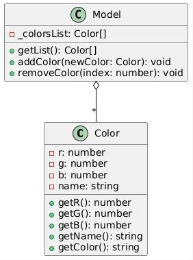

# **Tutorial de UML para el tutorial fahrenheit256**: [fahrenheit256: Proyecto en Javascript Vanilla + Bootstrap + Patron MVVM - Lista de colores : Metodos de array](https://www.youtube.com/watch?v=hwTM1YW3Azw)


## **Índice**
1. [Parte 1 - Modelo](#parte-1-modelo)

## **1. Parte 1 - Modelo** <a name="parte-1-modelo"></a>
El código en *js/Model.js* define dos componentes principales:
  **Color** y **Model**, que funcionan como "factorías" de objetos.

Buena pregunta. Digo que funcionan como **"factorías de objetos"** por la forma en que
  están escritas en el archivo js/Model.js.

  En lugar de usar la sintaxis de class de JavaScript (que es más moderna), el código utiliza un patrón de diseño llamado **"Factory Function"** (Función de Fábrica).

  Así es como funciona:

   1. Es una Función, no una Clase: Tanto Color como Model son variables que contienen una función, no una clase.
   2. No se usa `new`: Para crear un "color" o un "modelo", no haces new Color() como lo harías con una clase. Simplemente invocas la función: Color(...).
   3. Retorna un Objeto Nuevo: El trabajo de esa función es construir y devolver un objeto completamente nuevo. Fíjate en la última parte de ambas funciones: return ({ ... }). Están devolviendo un objeto literal con un conjunto de métodos.

  En resumen, llamas a una función y esta "fabrica" y te devuelve un objeto listo para usar. Este es un patrón muy común en JavaScript, especialmente en código más antiguo, para crear objetos y mantener ciertas variables "privadas" (como _r, _g, _b en tu código), un concepto que las clases de JavaScript ahora manejan de forma más directa.


 He identificado lo siguiente:

   * **Color**: Se puede modelar como una clase con atributos para los valores de color (r, g, b) y un nombre. También tiene métodos para obtener estos valores.
   * **Model**: Se puede modelar como una clase que gestiona una lista de objetos Color. Tiene métodos para añadir, eliminar y obtener la lista de colores.
   * **Relación**: La clase Model tiene una relación de agregación con la clase Color (un "Modelo" contiene muchos "Colores").
   El motivo para describirlo como una **relación de agregación** se basa en cómo interactúan Model y Color en tu código.

  En UML, una agregación es un tipo específico de relación **"tiene-un"** (a "has-a" relationship) donde:

   1. Un objeto "todo" contiene objetos "parte".
       * En tu caso, la instancia de Model es el "todo" y los objetos Color son las "partes". El Model "tiene" una lista de colores (_colorsList).

   2. Las "partes" pueden existir independientemente del "todo".
       * Esta es la clave para que sea agregación y no una relación más fuerte como la composición.

  Analizando tu código:

   * El Model no crea los objetos Color. Fíjate en el método addColor(newColor). Recibe un objeto newColor que debe haber sido creado en otro lugar del programa.
   * Si una instancia de Model fuera eliminada, los objetos Color que contenía no se destruirían necesariamente. Podrían seguir existiendo en otras partes de tu aplicación.

  En resumen: como el Model gestiona una colección de objetos Color que tienen un ciclo de vida independiente, la relación se describe mejor como agregación.

  Si el Model fuera el único responsable de crear y destruir los objetos Color (por ejemplo, si tuviera un método createColor(r,g,b) y los destruyera al eliminarse), entonces sería una composición.


<table>
  <tr>
    <th>Diagrama Renderizado</th>
    <th>Código PlantUML sin Renderizar</th>
    <th>Gráfico GIT</th>
  </tr>
  <tr>
  <td>
      
  ```plantuml
      @startuml
      class Color {
        -r: number
        -g: number
        -b: number
        -name: string
        +getR(): number
        +getG(): number
        +getB(): number
        +getName(): string
        +getColor(): string
      }
      
      class Model {
        -_colorsList: Color[]
        +getList(): Color[]
        +addColor(newColor: Color): void
        +removeColor(index: number): void
      }
      
      Model o-- "*" Color
      @enduml
  ```

  </td>
  <td>
      <!-- Columna 2: Código PlantUML sin renderizar -->
  <pre>

      @startuml
      class Color {
        -r: number
        -g: number
        -b: number
        -name: string
        +getR(): number
        +getG(): number
        +getB(): number
        +getName(): string
        +getColor(): string
      }
      
      class Model {
        -_colorsList: Color[]
        +getList(): Color[]
        +addColor(newColor: Color): void
        +removeColor(index: number): void
      }
      
      Model o-- "*" Color
      @enduml

  </pre>
  </td>
  <td>
      <!-- Columna 3: Gráfico Git-->
    
  </td>
  </tr>
</table>


